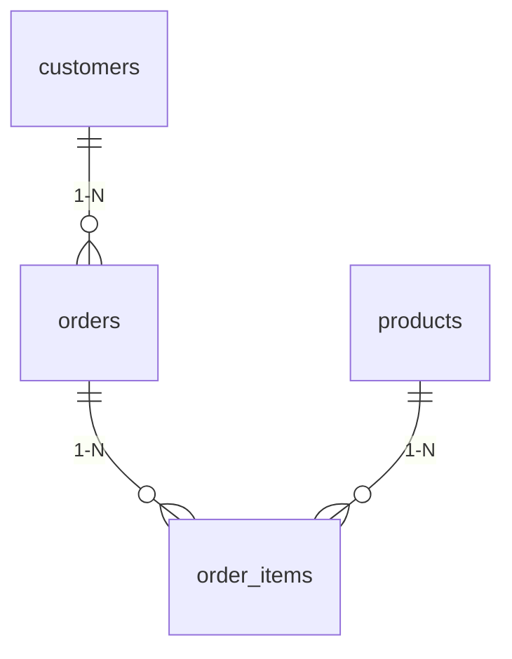

# PyQt

PyQt - это набор привязок Python для кроссплатформенного фреймворка для разработки приложений Qt.

## 1. Установка и настройка

### 1.1 Создание виртуального окружения

Рекомендуется использовать виртуальное окружение для изоляции зависимостей проекта:

```bash
# Создание виртуального окружения
python -m venv pyqt_venv

# Активация в Windows
pyqt_venv\Scripts\activate

# Активация в Linux/Mac
source pyqt_venv/bin/activate
```

### 1.2 Установка PyQt

После активации виртуального окружения установите PyQt:

```bash
# Установка PyQt6
pip install PyQt6

# Для работы с базами данных
pip install PyMySQL

# Сохранение зависимостей в файл
pip freeze > requirements.txt
```

### 1.3 Проверка установки

Создайте тестовый файл `test_pyqt.py`:

```python
import sys
from PyQt6.QtWidgets import QApplication, QLabel

app = QApplication(sys.argv)
label = QLabel("PyQt6 успешно установлен!")
label.show()
sys.exit(app.exec())
```

Запустите его:

```bash
python test_pyqt.py
```

## 2. Основы интерфейса

### 2.1 Структура базового приложения

Минимальная структура для любого PyQt-приложения:

```python
import sys
from PyQt6.QtWidgets import QApplication, QMainWindow

class MainWindow(QMainWindow):
    def __init__(self):
        super().__init__()
        
        # Заголовок окна
        self.setWindowTitle("Моё приложение")
        
        # Размер окна
        self.setGeometry(100, 100, 400, 300)  # x, y, width, height
        
        # Здесь добавляем виджеты и настраиваем UI

# Запуск приложения
app = QApplication(sys.argv)
window = MainWindow()
window.show()
sys.exit(app.exec())
```

### 2.2 Основные макеты (layouts)

PyQt предлагает несколько типов макетов для организации виджетов:

#### Вертикальный макет (QVBoxLayout)

```python
import sys
from PyQt6.QtWidgets import QApplication, QMainWindow, QWidget, QVBoxLayout, QPushButton

class MainWindow(QMainWindow):
    def __init__(self):
        super().__init__()
        self.setWindowTitle("Вертикальный макет")
        
        # Создаем центральный виджет
        central_widget = QWidget()
        self.setCentralWidget(central_widget)
        
        # Создаем вертикальный макет
        layout = QVBoxLayout(central_widget)
        
        # Добавляем кнопки
        for i in range(1, 4):
            button = QPushButton(f"Кнопка {i}")
            layout.addWidget(button)

app = QApplication(sys.argv)
window = MainWindow()
window.show()
sys.exit(app.exec())
```

#### Горизонтальный макет (QHBoxLayout)

```python
# Замените QVBoxLayout на QHBoxLayout для горизонтального расположения
from PyQt6.QtWidgets import QHBoxLayout

layout = QHBoxLayout(central_widget)
```

#### Сеточный макет (QGridLayout)

```python
import sys
from PyQt6.QtWidgets import QApplication, QMainWindow, QWidget, QGridLayout, QPushButton

class MainWindow(QMainWindow):
    def __init__(self):
        super().__init__()
        self.setWindowTitle("Сеточный макет")
        
        central_widget = QWidget()
        self.setCentralWidget(central_widget)
        
        # Создаем сеточный макет
        layout = QGridLayout(central_widget)
        
        # Добавляем кнопки в виде сетки
        names = [
            '1', '2', '3',
            '4', '5', '6',
            '7', '8', '9',
            '*', '0', '#'
        ]
        
        positions = [(i, j) for i in range(4) for j in range(3)]
        
        for position, name in zip(positions, names):
            button = QPushButton(name)
            layout.addWidget(button, *position)

app = QApplication(sys.argv)
window = MainWindow()
window.show()
sys.exit(app.exec())
```

#### Форменный макет (QFormLayout)

```python
import sys
from PyQt6.QtWidgets import QApplication, QMainWindow, QWidget, QFormLayout, QLineEdit, QLabel

class MainWindow(QMainWindow):
    def __init__(self):
        super().__init__()
        self.setWindowTitle("Форменный макет")
        
        central_widget = QWidget()
        self.setCentralWidget(central_widget)
        
        # Создаем форменный макет (пары ярлык-поле)
        layout = QFormLayout(central_widget)
        
        # Добавляем поля формы
        layout.addRow("Имя:", QLineEdit())
        layout.addRow("Email:", QLineEdit())
        layout.addRow("Возраст:", QLineEdit())

app = QApplication(sys.argv)
window = MainWindow()
window.show()
sys.exit(app.exec())
```

### 2.3 Шпаргалка по макетам

| Макет | Использование | Когда применять |
|-------|--------------|----------------|
| QVBoxLayout | Элементы в столбик сверху вниз | Для списков, меню, форм |
| QHBoxLayout | Элементы в строчку слева направо | Для панелей инструментов, кнопок действий |
| QGridLayout | Элементы в виде таблицы | Для калькуляторов, сложных форм |
| QFormLayout | Пары ярлык-поле | Для форм ввода данных |

## 3. Интерактивные элементы

### 3.1 Кнопки и действия

```python
import sys
from PyQt6.QtWidgets import QApplication, QMainWindow, QPushButton, QVBoxLayout, QWidget, QLabel

class MainWindow(QMainWindow):
    def __init__(self):
        super().__init__()
        self.setWindowTitle("Обработка событий")
        
        central_widget = QWidget()
        self.setCentralWidget(central_widget)
        
        layout = QVBoxLayout(central_widget)
        
        # Создаем метку для вывода результата
        self.result_label = QLabel("Нажмите кнопку")
        layout.addWidget(self.result_label)
        
        # Создаем кнопку с подключением к обработчику
        button = QPushButton("Нажми меня")
        button.clicked.connect(self.on_button_click)
        layout.addWidget(button)
        
        # Счетчик нажатий
        self.counter = 0
    
    def on_button_click(self):
        self.counter += 1
        self.result_label.setText(f"Кнопка нажата {self.counter} раз")

app = QApplication(sys.argv)
window = MainWindow()
window.show()
sys.exit(app.exec())
```

### 3.2 Поля ввода и списки

```python
import sys
from PyQt6.QtWidgets import (
    QApplication, QMainWindow, QWidget, QVBoxLayout,
    QLabel, QLineEdit, QListWidget, QPushButton
)

class MainWindow(QMainWindow):
    def __init__(self):
        super().__init__()
        self.setWindowTitle("Работа со списками")
        
        central_widget = QWidget()
        self.setCentralWidget(central_widget)
        
        layout = QVBoxLayout(central_widget)
        
        # Поле ввода с меткой
        layout.addWidget(QLabel("Введите язык:"))
        self.input_field = QLineEdit()
        layout.addWidget(self.input_field)
        
        # Кнопка добавления
        add_button = QPushButton("Добавить в список")
        add_button.clicked.connect(self.add_to_list)
        layout.addWidget(add_button)
        
        # Список с предустановленными элементами
        layout.addWidget(QLabel("Любимые языки:"))
        self.list_widget = QListWidget()
        self.list_widget.addItems(["Python", "C++", "JavaScript"])
        layout.addWidget(self.list_widget)
        
        # Кнопка для отображения выбранного элемента
        show_button = QPushButton("Показать выбранный")
        show_button.clicked.connect(self.show_selected)
        layout.addWidget(show_button)
        
        # Результат выбора
        self.result_label = QLabel("Выберите элемент")
        layout.addWidget(self.result_label)
    
    def add_to_list(self):
        text = self.input_field.text().strip()
        if text:
            self.list_widget.addItem(text)
            self.input_field.clear()
    
    def show_selected(self):
        if self.list_widget.currentItem():
            selected = self.list_widget.currentItem().text()
            self.result_label.setText(f"Выбрано: {selected}")

app = QApplication(sys.argv)
window = MainWindow()
window.show()
sys.exit(app.exec())
```

### 3.3 Комбинированные списки и флажки

```python
import sys
from PyQt6.QtWidgets import (
    QApplication, QMainWindow, QWidget, QVBoxLayout,
    QLabel, QComboBox, QCheckBox
)

class MainWindow(QMainWindow):
    def __init__(self):
        super().__init__()
        self.setWindowTitle("Выпадающие списки и флажки")
        
        central_widget = QWidget()
        self.setCentralWidget(central_widget)
        
        layout = QVBoxLayout(central_widget)
        
        # Выпадающий список
        layout.addWidget(QLabel("Выберите ОС:"))
        self.combo = QComboBox()
        self.combo.addItems(["Windows", "Linux", "macOS", "Android", "iOS"])
        self.combo.currentIndexChanged.connect(self.on_combo_changed)
        layout.addWidget(self.combo)
        
        # Флажки
        layout.addWidget(QLabel("Выберите навыки:"))
        
        self.skill_boxes = []
        for skill in ["Программирование", "Дизайн", "Базы данных", "Сети"]:
            checkbox = QCheckBox(skill)
            checkbox.stateChanged.connect(self.on_check_changed)
            layout.addWidget(checkbox)
            self.skill_boxes.append(checkbox)
        
        # Результат выбора
        self.result_label = QLabel("Сделайте выбор")
        layout.addWidget(self.result_label)
    
    def on_combo_changed(self):
        self.update_result()
    
    def on_check_changed(self):
        self.update_result()
    
    def update_result(self):
        os = self.combo.currentText()
        skills = [box.text() for box in self.skill_boxes if box.isChecked()]
        
        result = f"ОС: {os}\nНавыки: {', '.join(skills) if skills else 'не выбраны'}"
        self.result_label.setText(result)

app = QApplication(sys.argv)
window = MainWindow()
window.show()
sys.exit(app.exec())
```

### 3.4 Чек-лист важнейших элементов

| Элемент | Класс | Основное использование |
|---------|-------|------------------------|
| Кнопка | QPushButton | Для действий пользователя |
| Метка | QLabel | Для отображения текста |
| Поле ввода | QLineEdit | Для ввода строк текста |
| Флажок | QCheckBox | Для опции вкл/выкл |
| Радио-кнопка | QRadioButton | Для выбора одного варианта из группы |
| Выпадающий список | QComboBox | Для компактного выбора из списка |
| Список | QListWidget | Для отображения и выбора из списка |
| Ползунок | QSlider | Для выбора числовых значений |
| Таблица | QTableWidget | Для табличных данных |
| Вкладки | QTabWidget | Для организации интерфейса по вкладкам |

## 4. Практический пример: простой редактор заметок

```python
import sys
import json
from PyQt6.QtWidgets import (
    QApplication, QMainWindow, QWidget, QVBoxLayout, QHBoxLayout,
    QPushButton, QTextEdit, QListWidget, QInputDialog, QMessageBox
)

class NotesApp(QMainWindow):
    def __init__(self):
        super().__init__()
        self.setWindowTitle("Редактор заметок")
        self.setGeometry(100, 100, 800, 500)
        
        # Данные заметок
        self.notes = {}
        self.current_note = None
        
        # Настройка интерфейса
        central_widget = QWidget()
        self.setCentralWidget(central_widget)
        
        # Главный горизонтальный макет
        main_layout = QHBoxLayout(central_widget)
        
        # Левая панель со списком и кнопками
        left_panel = QWidget()
        left_layout = QVBoxLayout(left_panel)
        
        # Список заметок
        self.notes_list = QListWidget()
        self.notes_list.currentItemChanged.connect(self.on_note_selected)
        left_layout.addWidget(self.notes_list)
        
        # Кнопки действий
        buttons_layout = QHBoxLayout()
        
        self.add_btn = QPushButton("Добавить")
        self.add_btn.clicked.connect(self.add_note)
        buttons_layout.addWidget(self.add_btn)
        
        self.delete_btn = QPushButton("Удалить")
        self.delete_btn.clicked.connect(self.delete_note)
        buttons_layout.addWidget(self.delete_btn)
        
        left_layout.addLayout(buttons_layout)
        
        # Правая панель для редактирования
        right_panel = QWidget()
        right_layout = QVBoxLayout(right_panel)
        
        # Текстовое поле для заметки
        self.note_edit = QTextEdit()
        right_layout.addWidget(self.note_edit)
        
        # Кнопка сохранения
        self.save_btn = QPushButton("Сохранить")
        self.save_btn.clicked.connect(self.save_note)
        right_layout.addWidget(self.save_btn)
        
        # Добавляем панели в главный макет
        main_layout.addWidget(left_panel, 1)  # 1 - относительная доля в макете
        main_layout.addWidget(right_panel, 2)  # 2 - относительная доля в макете
        
        # Загружаем заметки при старте
        self.load_notes()
    
    def load_notes(self):
        # В реальном приложении здесь была бы загрузка из файла
        # Для примера используем несколько заготовленных заметок
        self.notes = {
            "Приветствие": "Добро пожаловать в редактор заметок!",
            "О программе": "Это простой редактор заметок на PyQt6.",
            "Справка": "Используйте кнопки для добавления и удаления заметок."
        }
        self.update_notes_list()
    
    def update_notes_list(self):
        self.notes_list.clear()
        self.notes_list.addItems(self.notes.keys())
    
    def on_note_selected(self, current, previous):
        if current:
            self.current_note = current.text()
            self.note_edit.setText(self.notes[self.current_note])
        else:
            self.current_note = None
            self.note_edit.clear()
    
    def add_note(self):
        title, ok = QInputDialog.getText(self, "Новая заметка", "Введите название:")
        if ok and title:
            if title in self.notes:
                QMessageBox.warning(self, "Ошибка", "Заметка с таким названием уже существует!")
                return
            
            self.notes[title] = ""
            self.update_notes_list()
            # Выбираем новую заметку
            items = self.notes_list.findItems(title, Qt.MatchExactly)
            if items:
                self.notes_list.setCurrentItem(items[0])
    
    def delete_note(self):
        if self.current_note:
            reply = QMessageBox.question(
                self, "Подтверждение", 
                f"Удалить заметку '{self.current_note}'?",
                QMessageBox.Yes | QMessageBox.No
            )
            
            if reply == QMessageBox.Yes:
                del self.notes[self.current_note]
                self.update_notes_list()
                self.note_edit.clear()
    
    def save_note(self):
        if self.current_note:
            self.notes[self.current_note] = self.note_edit.toPlainText()
            QMessageBox.information(self, "Сохранено", "Заметка сохранена!")

# Запуск приложения
if __name__ == "__main__":
    app = QApplication(sys.argv)
    window = NotesApp()
    window.show()
    sys.exit(app.exec())
```

## 5. Шпаргалка для запоминания

### Стандартная структура приложения:
```
1. Импорты
2. Определение главного класса окна (наследуем от QMainWindow)
3. Настройка интерфейса в __init__
4. Методы обработки событий
5. app = QApplication(sys.argv)
6. window = МойКласс()
7. window.show()
8. sys.exit(app.exec())
```

### Создание интерфейса (сверху вниз):
```
1. Создаем центральный виджет 
2. Создаем главный макет (QVBoxLayout, QHBoxLayout, QGridLayout)
3. Добавляем в макет виджеты или вложенные макеты
4. Подключаем сигналы к слотам (методам класса)
```

### Быстрая памятка по сигналам:
- Кнопка: `button.clicked.connect(self.метод)`
- Поле ввода: `line_edit.textChanged.connect(self.метод)`
- Список: `list_widget.currentItemChanged.connect(self.метод)`
- Флажок: `check_box.stateChanged.connect(self.метод)`

## 6. Мини-проект «Заказы» — ultra-лайт

### 1. Самая простая таблица

```sql
CREATE TABLE orders (
  id INT PRIMARY KEY AUTO_INCREMENT,
  customer VARCHAR(100),
  product  VARCHAR(100),
  qty      INT,
  price    DECIMAL(10,2)
);
```

Добавим данные:

```sql
INSERT INTO orders (customer, product, qty, price) VALUES
('Alice', 'SSD 512GB', 1, 120.00),
('Bob',   'USB-C Dock', 2, 60.00);
```

Посмотреть таблицу:

```sql
SELECT * FROM orders;
```

> Запомните: `CREATE`, `INSERT`, `SELECT` – три команды, с которых начинается 90 % задач 💡

### 2. Минимальное PyQt-окно для просмотра

Установим пакеты:

```bash
pip install PyQt6 PyMySQL
```

```python
import sys, pymysql
from PyQt6.QtWidgets import QApplication, QTableWidget, QTableWidgetItem

# 1) Подключаемся к БД
conn = pymysql.connect(host="localhost", user="root", password="pass", database="shop")

# 2) Читаем строки
with conn.cursor() as cur:
    cur.execute("SELECT id, customer, product, qty, price FROM orders")
    rows = cur.fetchall()

# 3) Создаём таблицу
app  = QApplication(sys.argv)
view = QTableWidget(len(rows), 5)  # 5 колонок
view.setHorizontalHeaderLabels(["ID", "Customer", "Product", "Qty", "Price"])

for r, row in enumerate(rows):
    for c, cell in enumerate(row):
        view.setItem(r, c, QTableWidgetItem(str(cell)))

view.resize(500, 300)
view.show()
sys.exit(app.exec())
```

> Всего три шага: `connect → fetch → show`. `QTableWidget` подходит новичкам, так как не требует отдельной модели.

### 3. Шпаргалка для запоминания

SQL:
• `CREATE TABLE` – создаём шкаф.
• `INSERT INTO`  – кладём вещи.
• `SELECT`       – смотрим, что лежит.

PyQt:
• `QApplication` – двигатель.
• `QTableWidget` – готовый стол.
• `setItem`      – кладём данные в ячейки.

Запомните эти 6 команд, и вы уже можете делать простые справочники 📚

### Попрактикуйтесь

• Добавьте столбец `date` типа `DATE`.
• Выведите только заказы Alice:

```sql
SELECT * FROM orders WHERE customer = 'Alice';
```

---

Теперь у вас есть полный путь: *сырые данные → нормализованная БД → бизнес-логика в SQL → GUI-клиент на PyQt6*. Попробуйте расширить задание, добавив формы редактирования клиентов и товаров. 

## 4. Продвинутое: представление, функция, процедура и триггер

> Всё на той же таблице `orders`, чтобы не усложнять.

### 4.1 Представление (VIEW)

```sql
CREATE OR REPLACE VIEW v_orders_totals AS
SELECT id, customer,
       qty * price AS total
FROM orders;
```

Теперь можно просто:

```sql
SELECT * FROM v_orders_totals;
```

### 4.2 Хранимая функция

```sql
DELIMITER $$
CREATE FUNCTION fn_order_total(p_id INT)
RETURNS DECIMAL(10,2)
DETERMINISTIC
BEGIN
  RETURN (SELECT total FROM v_orders_totals WHERE id = p_id);
END$$
DELIMITER ;
```

Проверим:

```sql
SELECT fn_order_total(1);
```

### 4.3 Хранимая процедура

Чтобы новичкам было проще — процедура всего лишь обёртка над `INSERT`.

```sql
DELIMITER $$
CREATE PROCEDURE sp_create_order(
  IN p_customer VARCHAR(100),
  IN p_product  VARCHAR(100),
  IN p_qty      INT,
  IN p_price    DECIMAL(10,2)
)
BEGIN
  INSERT INTO orders (customer, product, qty, price)
  VALUES (p_customer, p_product, p_qty, p_price);
END$$
DELIMITER ;
```

Вызов из MySQL:

```sql
CALL sp_create_order('Charlie', 'Keyboard', 1, 40.00);
```

### 4.4 Триггер

Сохраним новичков от отрицательных цен.

```sql
DELIMITER $$
CREATE TRIGGER trg_price_check
BEFORE INSERT ON orders
FOR EACH ROW
BEGIN
  IF NEW.price < 0 THEN
    SIGNAL SQLSTATE '45000' SET MESSAGE_TEXT = 'Цена не может быть отрицательной';
  END IF;
END$$
DELIMITER ;
```

### 4.5 Используем всё это из PyQt + PyMySQL

```python
# --- добавить заказ через процедуру ---
cur.callproc('sp_create_order', ('Dana', 'Mouse', 2, 25.00))
conn.commit()

# --- получить сумму заказа через функцию ---
cur.execute('SELECT fn_order_total(%s)', (1,))
print('Total #1 =', cur.fetchone()[0])

# --- показать представление ---
cur.execute('SELECT id, customer, total FROM v_orders_totals')
rows = cur.fetchall()
```

> Вся магия в трёх строках: `callproc`, `execute` с функцией, и `SELECT` из представления.

### Задания для самостоятельной практики

1. Напишите процедуру `sp_update_qty(p_id, p_qty)` для изменения количества.
2. Сделайте функцию, возвращающую общее число заказов (`COUNT(*)`).
3. Добавьте триггер AFTER DELETE: выводите сообщение в лог-таблицу `orders_log`.

--- 

## 5. Нормализация (3NF): когда данных становится много

### 5.1 Исходная «плоская» таблица (anti-pattern)

```sql
CREATE TABLE orders_raw (
  id INT PRIMARY KEY AUTO_INCREMENT,
  customer VARCHAR(100),
  address  VARCHAR(200),
  product1 VARCHAR(100), qty1 INT,
  product2 VARCHAR(100), qty2 INT,
  total DECIMAL(10,2)
);
```

Пример содержимого:

| id | customer | address           | product1    | qty1 | product2   | qty2 | total |
|----|----------|-------------------|-------------|------|------------|------|-------|
| 1  | Alice    | ул. Ленина, 1     | SSD 512GB   | 1    | USB-C Dock | 2    | 350   |
| 2  | Bob      | пр-т Мира, 10     | SSD 512GB   | 2    | *(null)*   | —    | 240   |
| 3  | Alice    | ул. Ленина, 1     | Web-камера  | 1    | USB-C Dock | 1    | 120   |

Проблемы:
- 🔄 Дублирование клиентов и адресов.
- ❌ Ограничение в два товара.
- 🙅‍♂️ Любое изменение структурных требований → `ALTER TABLE`.

---

_(Дальше идём пошагово: разбиваем таблицу на связанные сущности и получаем 3-ю нормальную форму.)_

### 5.2 Логические сущности



### 5.3 DDL (MySQL 8+)

```sql
CREATE TABLE customers (
  customer_id INT PRIMARY KEY AUTO_INCREMENT,
  name VARCHAR(100) NOT NULL
);

CREATE TABLE products (
  product_id INT PRIMARY KEY AUTO_INCREMENT,
  name  VARCHAR(100) NOT NULL,
  price DECIMAL(10,2) NOT NULL
);

CREATE TABLE orders (
  order_id INT PRIMARY KEY AUTO_INCREMENT,
  customer_id INT NOT NULL,
  created_at TIMESTAMP DEFAULT CURRENT_TIMESTAMP,
  FOREIGN KEY (customer_id) REFERENCES customers(customer_id)
);

CREATE TABLE order_items (
  order_id   INT,
  product_id INT,
  qty INT CHECK (qty > 0),
  PRIMARY KEY (order_id, product_id),
  FOREIGN KEY (order_id)   REFERENCES orders(order_id)   ON DELETE CASCADE,
  FOREIGN KEY (product_id) REFERENCES products(product_id)
);
```

### 5.4 Представление для итогов

```sql
CREATE OR REPLACE VIEW v_order_summary AS
SELECT o.order_id,
       c.name AS customer,
       SUM(p.price * i.qty) AS total
FROM orders o
JOIN customers c ON c.customer_id = o.customer_id
JOIN order_items i USING(order_id)
JOIN products p   USING(product_id)
GROUP BY o.order_id;
```

### 5.5 Пример работы из PyQt / PyMySQL

```python
cur.execute("""
SELECT order_id, customer, total
FROM v_order_summary
ORDER BY total DESC
""")
rows = cur.fetchall()
# rows => [(1, 'Alice', 350.00), ...]
```

> Разница с "ultra-лайт"-версией одна: теперь итог вычисляется через JOIN'ы, а не умножением `qty * price` в одной таблице.

### 5.6 Практика

• Добавьте столбец `email` в `customers`.  
• Сделайте функцию `fn_customer_spend(id)` — сколько клиент потратил всего.  
• Постройте `QTableWidget`, показывающий ТОП-5 клиентов по обороту (используйте `ORDER BY total DESC LIMIT 5`).

--- 