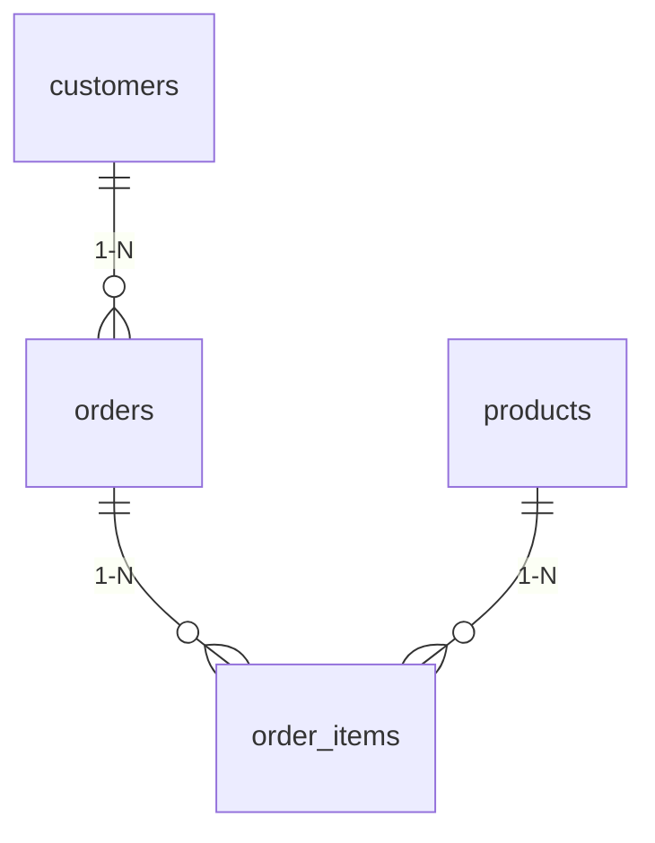

# PyQt

PyQt - это набор привязок Python для кроссплатформенного фреймворка для разработки приложений Qt.

## Установка

Для установки PyQt вы можете использовать pip:

```bash
pip install PyQt6
```

## Основные виджеты

Qt предоставляет множество виджетов.

### Окно

Основное окно приложения.

```python
import sys
from PyQt6.QtWidgets import QApplication, QWidget

app = QApplication(sys.argv)
window = QWidget()
window.show()
sys.exit(app.exec())
```

### Кнопка

Стандартная кнопка, на которую можно нажать.

```python
import sys
from PyQt6.QtWidgets import QApplication, QPushButton

app = QApplication(sys.argv)
btn = QPushButton("Нажми меня!")
btn.clicked.connect(lambda: print("Клик!"))
btn.resize(120, 40)  # необязательно, просто для наглядности
btn.show()
sys.exit(app.exec())
```

### Ещё 4 базовых виджета за 60 секунд

```python
import sys
from PyQt6.QtWidgets import (
    QApplication, QWidget, QLabel, QLineEdit,
    QListWidget, QVBoxLayout, QPushButton
)

app = QApplication(sys.argv)
win = QWidget(); win.setWindowTitle("Базовые виджеты")

label = QLabel("Имя:")
edit  = QLineEdit()
listw = QListWidget(); listw.addItems(["Python", "C++", "Go"])
btn   = QPushButton("Показать выбор")

btn.clicked.connect(lambda: print("Вы выбрали:", listw.currentItem().text()))

# Вернули пример макета, но миниатюрно:
box = QVBoxLayout(win)
for w in (label, edit, listw, btn):
    box.addWidget(w)

win.resize(250, 300)
win.show()
sys.exit(app.exec())
```

> Запомните виджеты: `QLabel`, `QLineEdit`, `QListWidget`, `QPushButton` + любой макет (`QVBoxLayout`). Этого набора хватит для первых GUI.

## Мини-проект «Заказы» — ultra-лайт

### 1. Самая простая таблица

```sql
CREATE TABLE orders (
  id INT PRIMARY KEY AUTO_INCREMENT,
  customer VARCHAR(100),
  product  VARCHAR(100),
  qty      INT,
  price    DECIMAL(10,2)
);
```

Добавим данные:

```sql
INSERT INTO orders (customer, product, qty, price) VALUES
('Alice', 'SSD 512GB', 1, 120.00),
('Bob',   'USB-C Dock', 2, 60.00);
```

Посмотреть таблицу:

```sql
SELECT * FROM orders;
```

> Запомните: `CREATE`, `INSERT`, `SELECT` – три команды, с которых начинается 90 % задач 💡

### 2. Минимальное PyQt-окно для просмотра

Установим пакеты:

```bash
pip install PyQt6 PyMySQL
```

```python
import sys, pymysql
from PyQt6.QtWidgets import QApplication, QTableWidget, QTableWidgetItem

# 1) Подключаемся к БД
conn = pymysql.connect(host="localhost", user="root", password="pass", database="shop")

# 2) Читаем строки
with conn.cursor() as cur:
    cur.execute("SELECT id, customer, product, qty, price FROM orders")
    rows = cur.fetchall()

# 3) Создаём таблицу
app  = QApplication(sys.argv)
view = QTableWidget(len(rows), 5)  # 5 колонок
view.setHorizontalHeaderLabels(["ID", "Customer", "Product", "Qty", "Price"])

for r, row in enumerate(rows):
    for c, cell in enumerate(row):
        view.setItem(r, c, QTableWidgetItem(str(cell)))

view.resize(500, 300)
view.show()
sys.exit(app.exec())
```

> Всего три шага: `connect → fetch → show`. `QTableWidget` подходит новичкам, так как не требует отдельной модели.

### 3. Шпаргалка для запоминания

SQL:
• `CREATE TABLE` – создаём шкаф.
• `INSERT INTO`  – кладём вещи.
• `SELECT`       – смотрим, что лежит.

PyQt:
• `QApplication` – двигатель.
• `QTableWidget` – готовый стол.
• `setItem`      – кладём данные в ячейки.

Запомните эти 6 команд, и вы уже можете делать простые справочники 📚

### Попрактикуйтесь

• Добавьте столбец `date` типа `DATE`.
• Выведите только заказы Alice:

```sql
SELECT * FROM orders WHERE customer = 'Alice';
```

---

Теперь у вас есть полный путь: *сырые данные → нормализованная БД → бизнес-логика в SQL → GUI-клиент на PyQt6*. Попробуйте расширить задание, добавив формы редактирования клиентов и товаров. 

## 4. Продвинутое: представление, функция, процедура и триггер

> Всё на той же таблице `orders`, чтобы не усложнять.

### 4.1 Представление (VIEW)

```sql
CREATE OR REPLACE VIEW v_orders_totals AS
SELECT id, customer,
       qty * price AS total
FROM orders;
```

Теперь можно просто:

```sql
SELECT * FROM v_orders_totals;
```

### 4.2 Хранимая функция

```sql
DELIMITER $$
CREATE FUNCTION fn_order_total(p_id INT)
RETURNS DECIMAL(10,2)
DETERMINISTIC
BEGIN
  RETURN (SELECT total FROM v_orders_totals WHERE id = p_id);
END$$
DELIMITER ;
```

Проверим:

```sql
SELECT fn_order_total(1);
```

### 4.3 Хранимая процедура

Чтобы новичкам было проще — процедура всего лишь обёртка над `INSERT`.

```sql
DELIMITER $$
CREATE PROCEDURE sp_create_order(
  IN p_customer VARCHAR(100),
  IN p_product  VARCHAR(100),
  IN p_qty      INT,
  IN p_price    DECIMAL(10,2)
)
BEGIN
  INSERT INTO orders (customer, product, qty, price)
  VALUES (p_customer, p_product, p_qty, p_price);
END$$
DELIMITER ;
```

Вызов из MySQL:

```sql
CALL sp_create_order('Charlie', 'Keyboard', 1, 40.00);
```

### 4.4 Триггер

Сохраним новичков от отрицательных цен.

```sql
DELIMITER $$
CREATE TRIGGER trg_price_check
BEFORE INSERT ON orders
FOR EACH ROW
BEGIN
  IF NEW.price < 0 THEN
    SIGNAL SQLSTATE '45000' SET MESSAGE_TEXT = 'Цена не может быть отрицательной';
  END IF;
END$$
DELIMITER ;
```

### 4.5 Используем всё это из PyQt + PyMySQL

```python
# --- добавить заказ через процедуру ---
cur.callproc('sp_create_order', ('Dana', 'Mouse', 2, 25.00))
conn.commit()

# --- получить сумму заказа через функцию ---
cur.execute('SELECT fn_order_total(%s)', (1,))
print('Total #1 =', cur.fetchone()[0])

# --- показать представление ---
cur.execute('SELECT id, customer, total FROM v_orders_totals')
rows = cur.fetchall()
```

> Вся магия в трёх строках: `callproc`, `execute` с функцией, и `SELECT` из представления.

### Задания для самостоятельной практики

1. Напишите процедуру `sp_update_qty(p_id, p_qty)` для изменения количества.
2. Сделайте функцию, возвращающую общее число заказов (`COUNT(*)`).
3. Добавьте триггер AFTER DELETE: выводите сообщение в лог-таблицу `orders_log`.

--- 

## 5. Нормализация (3NF): когда данных становится много

### 5.1 Исходная «плоская» таблица (anti-pattern)

```sql
CREATE TABLE orders_raw (
  id INT PRIMARY KEY AUTO_INCREMENT,
  customer VARCHAR(100),
  address  VARCHAR(200),
  product1 VARCHAR(100), qty1 INT,
  product2 VARCHAR(100), qty2 INT,
  total DECIMAL(10,2)
);
```

Пример содержимого:

| id | customer | address           | product1    | qty1 | product2   | qty2 | total |
|----|----------|-------------------|-------------|------|------------|------|-------|
| 1  | Alice    | ул. Ленина, 1     | SSD 512GB   | 1    | USB-C Dock | 2    | 350   |
| 2  | Bob      | пр-т Мира, 10     | SSD 512GB   | 2    | *(null)*   | —    | 240   |
| 3  | Alice    | ул. Ленина, 1     | Web-камера  | 1    | USB-C Dock | 1    | 120   |

Проблемы:
- 🔄 Дублирование клиентов и адресов.
- ❌ Ограничение в два товара.
- 🙅‍♂️ Любое изменение структурных требований → `ALTER TABLE`.

---

_(Дальше идём пошагово: разбиваем таблицу на связанные сущности и получаем 3-ю нормальную форму.)_

### 5.2 Логические сущности



### 5.3 DDL (MySQL 8+)

```sql
CREATE TABLE customers (
  customer_id INT PRIMARY KEY AUTO_INCREMENT,
  name VARCHAR(100) NOT NULL
);

CREATE TABLE products (
  product_id INT PRIMARY KEY AUTO_INCREMENT,
  name  VARCHAR(100) NOT NULL,
  price DECIMAL(10,2) NOT NULL
);

CREATE TABLE orders (
  order_id INT PRIMARY KEY AUTO_INCREMENT,
  customer_id INT NOT NULL,
  created_at TIMESTAMP DEFAULT CURRENT_TIMESTAMP,
  FOREIGN KEY (customer_id) REFERENCES customers(customer_id)
);

CREATE TABLE order_items (
  order_id   INT,
  product_id INT,
  qty INT CHECK (qty > 0),
  PRIMARY KEY (order_id, product_id),
  FOREIGN KEY (order_id)   REFERENCES orders(order_id)   ON DELETE CASCADE,
  FOREIGN KEY (product_id) REFERENCES products(product_id)
);
```

### 5.4 Представление для итогов

```sql
CREATE OR REPLACE VIEW v_order_summary AS
SELECT o.order_id,
       c.name AS customer,
       SUM(p.price * i.qty) AS total
FROM orders o
JOIN customers c ON c.customer_id = o.customer_id
JOIN order_items i USING(order_id)
JOIN products p   USING(product_id)
GROUP BY o.order_id;
```

### 5.5 Пример работы из PyQt / PyMySQL

```python
cur.execute("""
SELECT order_id, customer, total
FROM v_order_summary
ORDER BY total DESC
""")
rows = cur.fetchall()
# rows => [(1, 'Alice', 350.00), ...]
```

> Разница с "ultra-лайт"-версией одна: теперь итог вычисляется через JOIN'ы, а не умножением `qty * price` в одной таблице.

### 5.6 Практика

• Добавьте столбец `email` в `customers`.  
• Сделайте функцию `fn_customer_spend(id)` — сколько клиент потратил всего.  
• Постройте `QTableWidget`, показывающий ТОП-5 клиентов по обороту (используйте `ORDER BY total DESC LIMIT 5`).

--- 